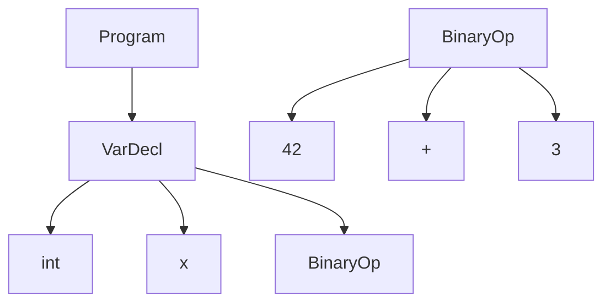
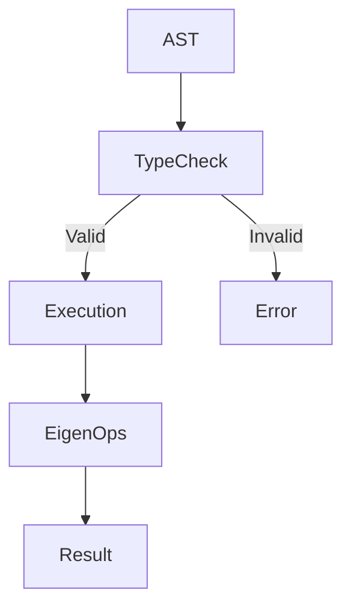
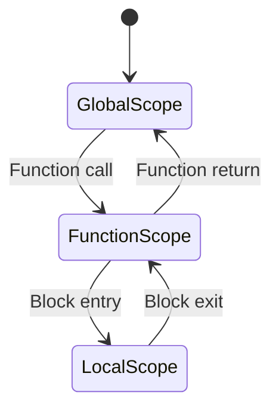
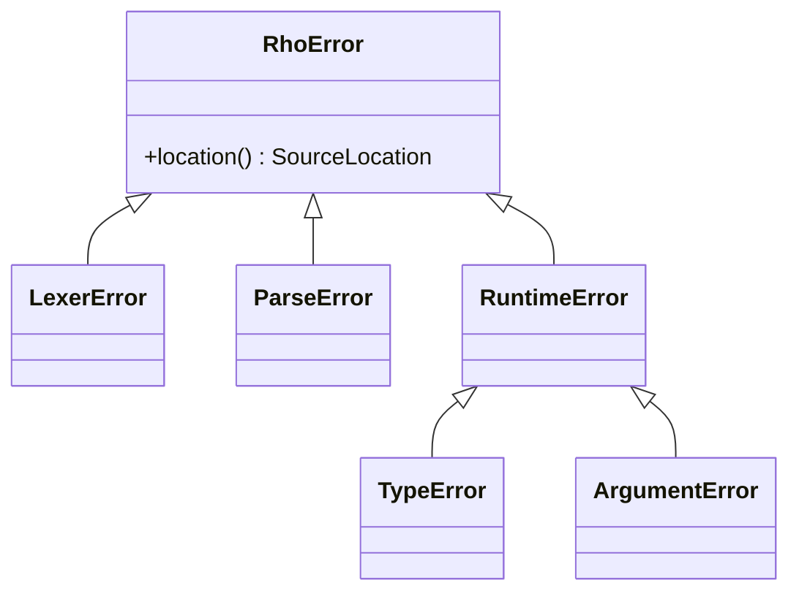
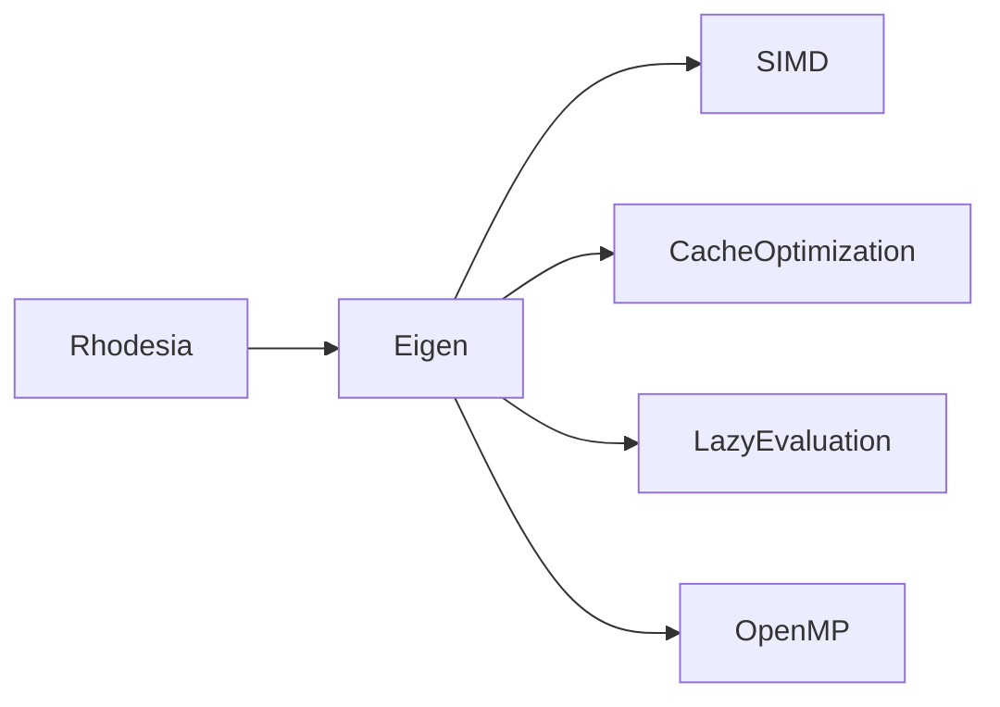

# Rhodesia Architecture

This page describes the internal architecture and design of the Rhodesia language.

## Table of Contents

- [System Overview](#system-overview)
- [Compiler Pipeline](#compiler-pipeline)
- [Type System](#type-system)
- [Memory Management](#memory-management)
- [Error Handling](#error-handling)
- [Performance Architecture](#performance-architecture)

## System Overview

Rhodesia follows a traditional compiler/interpreter architecture:

```
Source Code → Lexer → Parser → AST → Evaluator → Result
```

### Key Components

1. **Lexer**: Tokenizes source code
2. **Parser**: Builds Abstract Syntax Tree (AST)
3. **Symbol Table**: Manages variables and scopes
4. **Evaluator**: Executes the AST
5. **Built-ins**: Core functions and libraries
6. **Eigen Backend**: Numerical computation engine

## Compiler Pipeline

### Lexical Analysis

The lexer converts source code into tokens:

```rhodesia
// Source: int: x = 42 + 3
// Tokens: [KwInt, Colon, Identifier("x"), Equal, IntLiteral(42), Plus, IntLiteral(3)]
```

### Syntax Analysis

The parser builds an Abstract Syntax Tree (AST):



### Semantic Analysis

The evaluator checks types and executes operations:



## Type System

### RhoValue Type

```cpp
using RhoValue = std::variant<
    int64_t,        // Integers
    double,         // Float64
    std::string,    // Strings
    Eigen::VectorXd,// Vectors
    Eigen::MatrixXd // Matrices
>;
```

### Type Compatibility

| Operation | Compatible Types |
|-----------|------------------|
| Arithmetic | int ↔ float64, vector/matrix operations |
| Comparison | All numeric types |
| Assignment | Exact type match required |
| Broadcasting | Scalar ↔ vector/matrix |

## Memory Management

### Scope Management



### RAII Pattern

```cpp
class ScopeGuard {
public:
    explicit ScopeGuard(SymbolTable& table) : table_(table) {
        table_.enterScope();
    }
    ~ScopeGuard() {
        table_.exitScope();
    }
};
```

## Error Handling

### Error Hierarchy



### Common Error Types

| Error Type | Cause | Example |
|------------|-------|---------|
| `LexerError` | Invalid tokens | `int: x = 5 @ 3` |
| `ParseError` | Syntax errors | `if x > 0 print(x)` |
| `TypeError` | Type mismatch | `string: s = "hello" + 5` |
| `RuntimeError` | Execution errors | `vec: v = [1,2]; v[5]` |

## Performance Architecture

### Eigen Integration



### Optimization Techniques

1. **SIMD**: Single Instruction Multiple Data
2. **Cache Optimization**: Memory access patterns
3. **Lazy Evaluation**: Expression templates
4. **OpenMP**: Parallel execution

## Examples

### Compilation Process

```rhodesia
// Source code
vec: u = [1, 2, 3]
vec: v = [4, 5, 6]
float64: result = dot(u, v)

// Compilation steps:
1. Lexer: Tokenize into [KwVec, Colon, Identifier("u"), Equal, LBracket, ...]
2. Parser: Build AST with VarDecl and FunctionCall nodes
3. Evaluator: Execute dot product using Eigen
4. Result: 32.0
```

### Memory Management Example

```rhodesia
fun example() -> void {
    // Local scope created
    vec: local = zeros(100)

    {
        // Nested scope
        vec: nested = ones(50)
        // nested is destroyed here
    }

    // local is destroyed when function returns
}
```

## Next Steps

- [Technical API](technical.md) - Low-level API details
- [Performance Guide](performance.md) - Optimization techniques
- [Error Reference](troubleshooting/errors.md) - Common errors
- [Language Syntax](language/syntax.md) - Syntax reference
