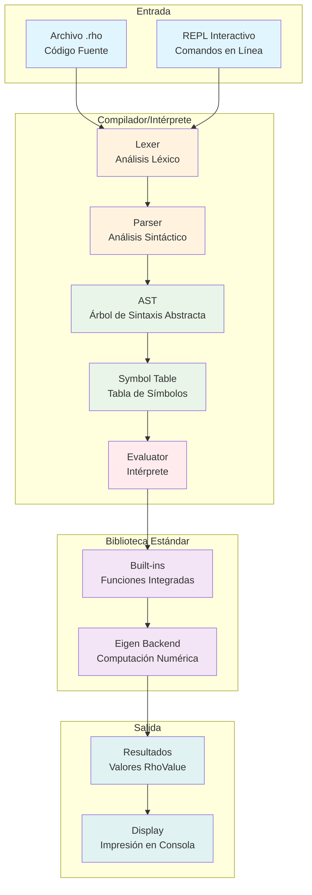
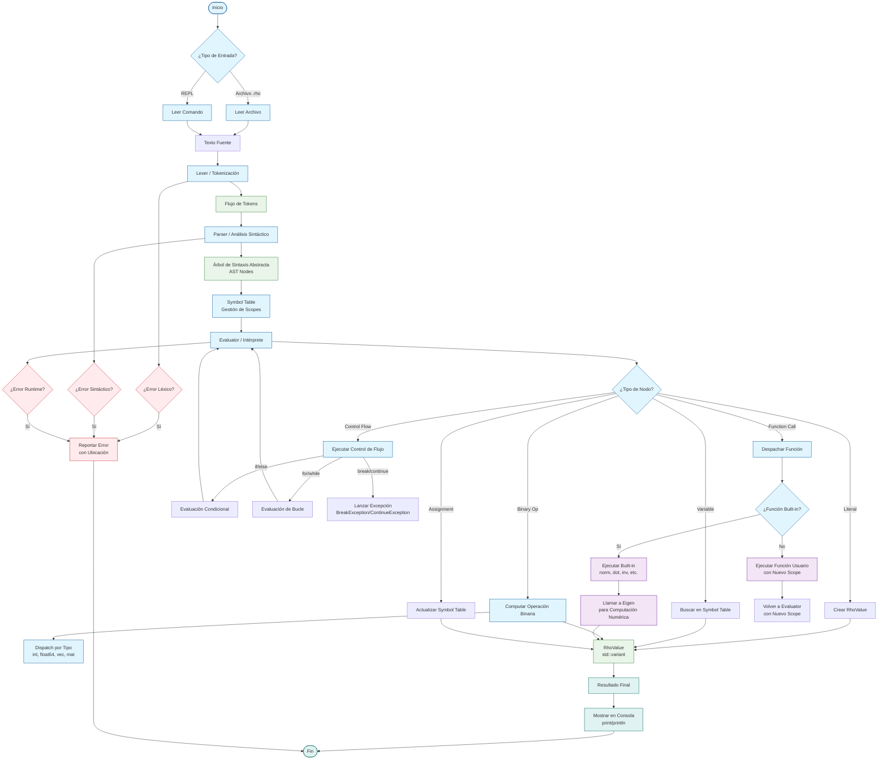
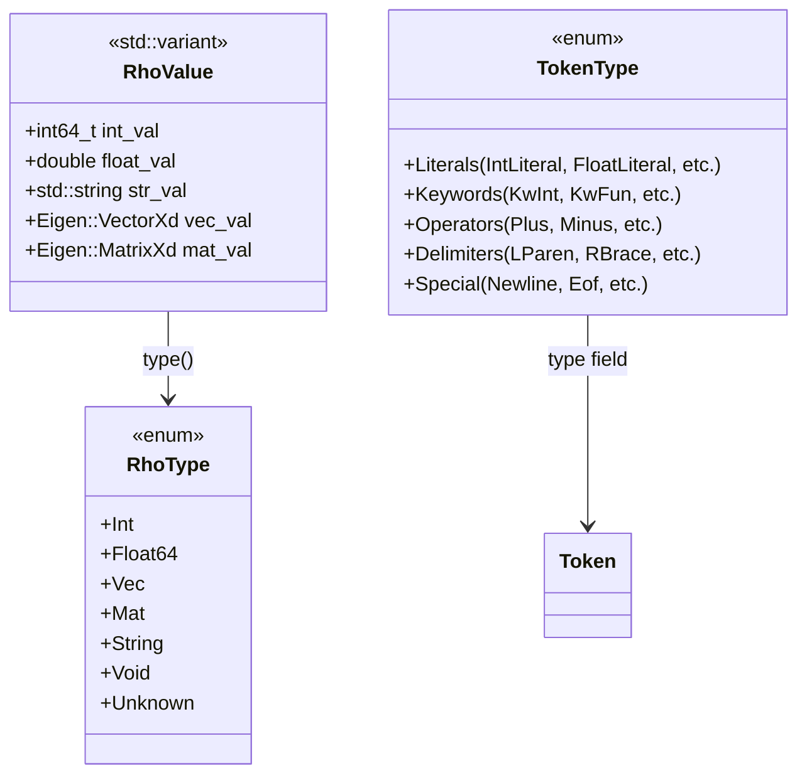
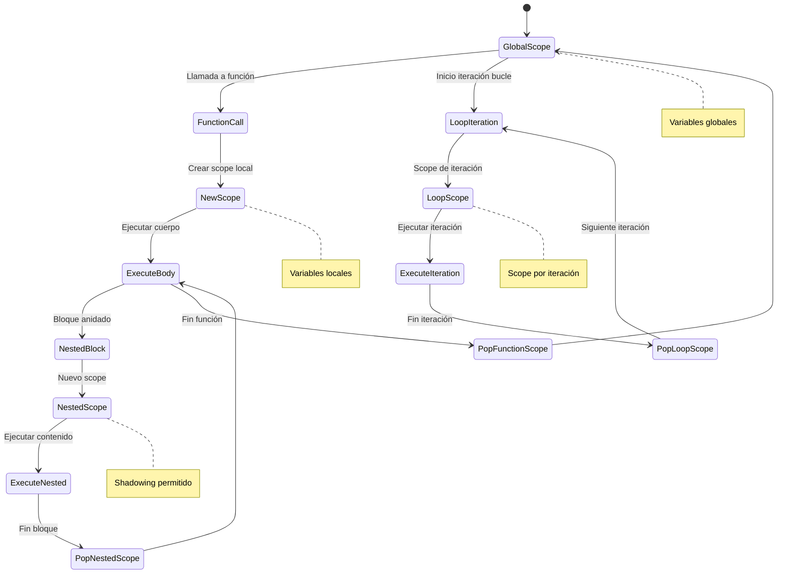
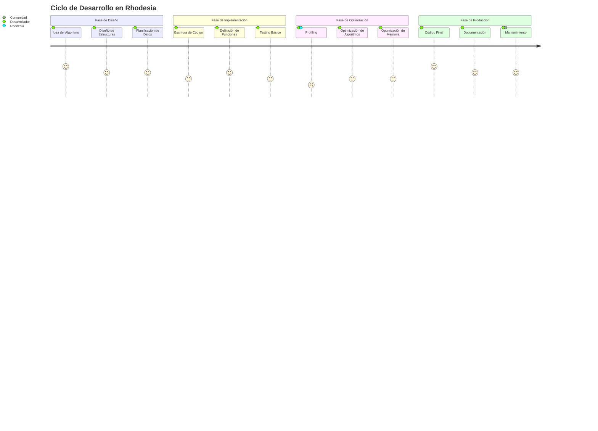

# Arquitectura y Flujo de Rhodesia

## Diagrama de Arquitectura General



## Flujo Detallado de Procesamiento



## Diagrama de Tipos de Datos



## Diagrama de Clases AST

```mermaid
classDiagram
    class ASTNode {
        <<abstract>>
        +accept(Visitor&) void
        +getLocation() SourceLocation
    }

    class ExprNode {
        <<abstract>>
    }

    class StmtNode {
        <<abstract>>
    }

    ASTNode <|-- ExprNode
    ASTNode <|-- StmtNode

    %% Nodos de Expresión
    ExprNode <|-- IntLiteralNode
    ExprNode <|-- FloatLiteralNode
    ExprNode <|-- StringLiteralNode
    ExprNode <|-- VectorLiteralNode
    ExprNode <|-- MatrixLiteralNode
    ExprNode <|-- IdentifierNode
    ExprNode <|-- BinaryOpNode
    ExprNode <|-- FunctionCallNode
    ExprNode <|-- IndexAccessNode

    %% Nodos de Sentencia
    StmtNode <|-- VarDeclNode
    StmtNode <|-- AssignmentNode
    StmtNode <|-- ReturnNode
    StmtNode <|-- BlockNode
    StmtNode <|-- IfStmtNode
    StmtNode <|-- ForLoopNode
    StmtNode <|-- WhileLoopNode
    StmtNode <|-- FunctionDeclNode

    %% Nodos Raíz
    StmtNode <|-- ProgramNode

    IntLiteralNode : +int64_t value
    FloatLiteralNode : +double value
    StringLiteralNode : +std::string value
    VectorLiteralNode : +std::vector<ExprNode*> elements
    MatrixLiteralNode : +std::vector<std::vector<ExprNode*>> rows

    IdentifierNode : +std::string name
    BinaryOpNode : +ExprNode* left, +TokenType op, +ExprNode* right
    FunctionCallNode : +std::string name, +std::vector<ExprNode*> args
    IndexAccessNode : +ExprNode* target, +ExprNode* index

    VarDeclNode : +RhoType type, +std::string name, +ExprNode* init
    AssignmentNode : +std::string name, +ExprNode* value
    ReturnNode : +ExprNode* value
    BlockNode : +std::vector<StmtNode*> statements
    IfStmtNode : +ExprNode* condition, +BlockNode* then, +BlockNode* else
    ForLoopNode : +std::string var, +ExprNode* iterable, +BlockNode* body
    WhileLoopNode : +ExprNode* condition, +BlockNode* body
    FunctionDeclNode : +std::string name, +std::vector<Param> params, +RhoType ret_type, +BlockNode* body
    ProgramNode : +std::vector<StmtNode*> statements
```

## Diagrama de Componentes del Evaluator

```mermaid
flowchart TD
    subgraph "Evaluator Class"
        EV[Evaluator] --> Visitor[Visitor Pattern<br/>Methods]
        EV --> SymbolAccess[Symbol Table<br/>Access]
    end

    subgraph "Visitor Methods"
        Visitor --> VisitInt[visit(IntLiteralNode)]
        Visitor --> VisitFloat[visit(FloatLiteralNode)]
        Visitor --> VisitVec[visit(VectorLiteralNode)]
        Visitor --> VisitMat[visit(MatrixLiteralNode)]
        Visitor --> VisitId[visit(IdentifierNode)]
        Visitor --> VisitBinOp[visit(BinaryOpNode)]
        Visitor --> VisitCall[visit(FunctionCallNode)]
        Visitor --> VisitIndex[visit(IndexAccessNode)]
        Visitor --> VisitVar[visit(VarDeclNode)]
        Visitor --> VisitAssign[visit(AssignmentNode)]
        Visitor --> VisitReturn[visit(ReturnNode)]
        Visitor --> VisitBlock[visit(BlockNode)]
        Visitor --> VisitIf[visit(IfStmtNode)]
        Visitor --> VisitFor[visit(ForLoopNode)]
        Visitor --> VisitWhile[visit(WhileLoopNode)]
        Visitor --> VisitFuncDecl[visit(FunctionDeclNode)]
    end

    subgraph "Helper Methods"
        EV --> BinaryOp[computeBinaryOp()]
        EV --> TypeCheck[checkTypeCompatibility()]
        EV --> ScopeGuard[ScopeGuard RAII]
    end

    subgraph "Built-in Integration"
        VisitCall --> BuiltinCheck{Is Built-in?}
        BuiltinCheck -->|Yes| CallBuiltin[Builtins::call()]
        BuiltinCheck -->|No| CallUserFunc[Lookup User Function]
    end

    subgraph "Eigen Integration"
        CallBuiltin --> EigenOps[Eigen Operations<br/>Matrix/Vector Math]
        BinaryOp --> EigenOps
    end

    VisitInt --> RhoValue[Return RhoValue]
    VisitFloat --> RhoValue
    VisitVec --> RhoValue
    VisitMat --> RhoValue
    VisitId --> RhoValue
    VisitBinOp --> RhoValue
    CallBuiltin --> RhoValue
    CallUserFunc --> RhoValue

    %% Estilos
    classDef evaluatorClass fill:#ffebee,stroke:#c62828
    classDef visitorClass fill:#fff3e0,stroke:#ef6c00
    classDef helperClass fill:#e8f5e8,stroke:#2e7d32
    classDef builtinClass fill:#f3e5f5,stroke:#6a1b9a

    class EV evaluatorClass
    class VisitInt,VisitFloat,VisitVec,VisitMat,VisitId,VisitBinOp,VisitCall,VisitIndex,VisitVar,VisitAssign,VisitReturn,VisitBlock,VisitIf,VisitFor,VisitWhile,VisitFuncDecl visitorClass
    class BinaryOp,TypeCheck,ScopeGuard helperClass
    class CallBuiltin,BuiltinCheck,CallUserFunc,EigenOps builtinClass
```

## Diagrama de Gestión de Memoria y Scopes



## Diagrama de Funciones Built-in y Eigen

```mermaid
graph LR
    subgraph "Built-in Registry"
        Registry[Builtins Registry<br/>Singleton]
        Registry --> Norm[norm(vec|mat)]
        Registry --> Dot[dot(vec, vec)]
        Registry --> Transpose[transpose(vec|mat)]
        Registry --> Inv[inv(mat)]
        Registry --> Sum[sum(vec|mat)]
        Registry --> Mean[mean(vec|mat)]
        Registry --> Creation[zeros, ones, eye, range]
        Registry --> Math[sqrt, exp, log, sin, cos, tan]
        Registry --> Info[rows, cols, size]
        Registry --> IO[print, println]
    end

    subgraph "Eigen Operations"
        Norm --> EigenNorm[Eigen::MatrixBase::norm()]
        Dot --> EigenDot[Eigen::VectorXd::dot()]
        Transpose --> EigenTranspose[.transpose()]
        Inv --> EigenLU[Eigen::FullPivLU::inverse()]
        Sum --> EigenSum[.sum()]
        Mean --> EigenMean[.mean()]
        Creation --> EigenConstructors[VectorXd::Zero(), Ones(), etc.]
        Math --> EigenArrayOps[array().sqrt(), exp(), etc.]
    end

    subgraph "SIMD Optimization"
        EigenNorm --> SIMD[SIMD Instructions]
        EigenDot --> SIMD
        EigenSum --> SIMD
        EigenArrayOps --> SIMD
    end

    subgraph "OpenMP (Optional)"
        SIMD --> OpenMP{Compile with<br/>-fopenmp?}
        OpenMP -->|Yes| Parallel[Parallel Execution<br/>Large Matrices]
        OpenMP -->|No| Sequential[Sequential Execution]
    end

    %% Estilos
    classDef registryClass fill:#f3e5f5,stroke:#6a1b9a
    classDef eigenClass fill:#e8f5e8,stroke:#2e7d32
    classDef optClass fill:#fff3e0,stroke:#ef6c00

    class Registry,Registry registryClass
    class EigenNorm,EigenDot,EigenTranspose,EigenLU,EigenSum,EigenMean,EigenConstructors,EigenArrayOps eigenClass
    class SIMD,Parallel,Sequential optClass
```

## Diagrama de Ciclo de Desarrollo



## Diagrama de Comparación con Otros Lenguajes

```mermaid
quadrantChart
    title Comparación: Rhodesia vs Lenguajes de Data Science

    x-axis Bajo Nivel --> Alto Nivel
    y-axis Rendimiento Bajo --> Rendimiento Alto

    quadrant-1 Alto Rendimiento
    quadrant-2 Alto Nivel
    quadrant-3 Bajo Rendimiento
    quadrant-4 Bajo Nivel

    C++: [0.1, 0.95]
    Python: [0.9, 0.3]
    R: [0.8, 0.4]
    Julia: [0.6, 0.8]
    MATLAB: [0.7, 0.6]
    Rhodesia: [0.4, 0.85]

    quadrant-1 (and Rhodesia): "Rendimiento Nativo"
    quadrant-2 (and Python,R): "Facilidad de Uso"
    quadrant-3 (and C++): "Complejidad Alta"
    quadrant-4 (and Julia,MATLAB): "Equilibrio"
```

## Leyenda de Colores

| Color | Significado |
|-------|-------------|
| 🔵 Azul Claro | Entrada/Salida |
| 🟠 Naranja | Procesamiento |
| 🟢 Verde | Datos/Estructuras |
| 🟣 Morado | Built-ins/Eigen |
| 🔴 Rojo | Evaluator |
| 🟡 Amarillo | Errores |

Esta documentación visual proporciona una comprensión completa de cómo funciona Rhodesia internamente, desde el código fuente hasta la ejecución final, facilitando tanto el aprendizaje como el desarrollo avanzado del lenguaje.
