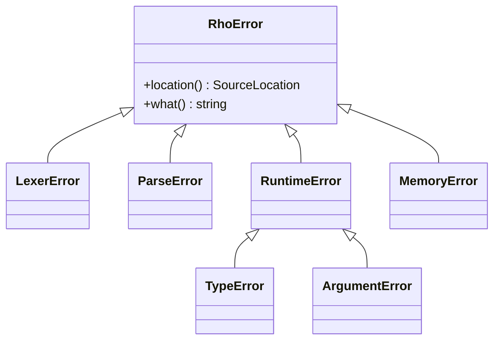

# Rhodesia Error Reference

This page documents common errors in Rhodesia and how to resolve them.

## Table of Contents

- [Error Types](#error-types)
- [Lexer Errors](#lexer-errors)
- [Parser Errors](#parser-errors)
- [Runtime Errors](#runtime-errors)
- [Type Errors](#type-errors)
- [Debugging Tips](#debugging-tips)

## Error Types

### Error Hierarchy



## Lexer Errors

### Invalid Tokens

**Error**: `Unexpected character: '{char}'`

**Cause**: Unrecognized character in source code

**Example**:
```rhodesia
int: x = 5 @ 3  // @ is not a valid operator
```

**Solution**: Replace with valid operator (`+`, `-`, `*`, `/`, etc.)

### Unterminated Strings

**Error**: `Unterminated string literal`

**Cause**: String literal missing closing quote

**Example**:
```rhodesia
string: msg = "Hello World  // Missing closing quote
```

**Solution**: Add closing quote

### Invalid Numbers

**Error**: `Invalid number format: '{token}'`

**Cause**: Malformed numeric literal

**Example**:
```rhodesia
float64: x = 3.14.59  // Two decimal points
int: y = 123abc      // Non-numeric characters
```

**Solution**: Fix number format

## Parser Errors

### Unexpected Tokens

**Error**: `Expected {expected}, but got {actual}`

**Cause**: Token different from expected

**Example**:
```rhodesia
int: x = 5 print(x)  // Missing semicolon or newline
```

**Solution**: Add missing token or correct syntax

### Unmatched Delimiters

**Error**: `Unmatched parenthesis/bracket/brace`

**Cause**: Missing closing delimiter

**Example**:
```rhodesia
vec: v = [1, 2, 3;    // Missing closing bracket
if x > 0 { println(x) // Missing closing brace
```

**Solution**: Add missing delimiter

### Incomplete Declarations

**Error**: `Incomplete variable declaration`

**Cause**: Variable declaration missing initialization

**Example**:
```rhodesia
int: x  // Missing initialization
```

**Solution**: Initialize variable

## Runtime Errors

### Undefined Variables

**Error**: `Undefined variable '{name}'`

**Cause**: Using undeclared variable

**Example**:
```rhodesia
println(x)  // x not declared
```

**Solution**: Declare variable before use

### Index Out of Bounds

**Error**: `Index {index} out of bounds for size {size}`

**Cause**: Accessing invalid array index

**Example**:
```rhodesia
vec: v = [1, 2, 3]
float64: x = v[5]  // Index 5 in vector of size 3
```

**Solution**: Check bounds before accessing

### Singular Matrix

**Error**: `Cannot invert singular matrix`

**Cause**: Attempting to invert non-invertible matrix

**Example**:
```rhodesia
mat: singular = [[1, 2], [2, 4]]  // Linearly dependent rows
mat: inv = inv(singular)           // Error
```

**Solution**: Check matrix condition number

### Dimension Mismatch

**Error**: `Dimension mismatch in {operation}`

**Cause**: Incompatible array dimensions

**Example**:
```rhodesia
vec: u = [1, 2]
vec: v = [1, 2, 3]
float64: dp = dot(u, v)  // Different sizes
```

**Solution**: Ensure compatible dimensions

## Type Errors

### Incompatible Operators

**Error**: `Cannot apply '{op}' to {type1} and {type2}`

**Cause**: Operation between incompatible types

**Example**:
```rhodesia
string: s = "hello"
int: x = s + 5  // Can't add string and int
```

**Solution**: Convert types or use valid operation

### Function Argument Errors

**Error**: `Function '{name}' expected {expected} but got {actual}`

**Cause**: Wrong argument type

**Example**:
```rhodesia
vec: v = [1, 2, 3]
mat: m = inv(v)  // inv expects matrix, not vector
```

**Solution**: Provide correct argument type

### Assignment Type Errors

**Error**: `Cannot assign {actual} to variable of type {expected}`

**Cause**: Assigning incompatible type

**Example**:
```rhodesia
vec: v = [1, 2, 3]
v = "string"  // Can't assign string to vec
```

**Solution**: Ensure type compatibility

## Debugging Tips

### Common Patterns

| Error | Likely Cause | Solution |
|-------|-------------|----------|
| `Unexpected character` | Typo or special character | Check syntax |
| `Undefined variable` | Variable not declared | Declare variable |
| `Index out of bounds` | Invalid index | Add bounds checking |
| `Dimension mismatch` | Incompatible sizes | Verify dimensions |
| `Matrix is singular` | Non-invertible matrix | Check condition number |

### Debugging Checklist

1. **Read full error message** (includes location)
2. **Check syntax** for typos
3. **Verify types** in operations
4. **Validate indices** for array access
5. **Simplify code** to isolate issue
6. **Consult documentation**

### Error Handling Patterns

```rhodesia
// Safe division
fun safe_divide(float64: a, float64: b) -> float64 {
    if b == 0 {
        println("Warning: Division by zero")
        return 0
    }
    return a / b
}

// Safe vector access
fun safe_access(vec: v, int: index) -> float64 {
    if index < 0 or index >= size(v) {
        println("Warning: Index out of bounds")
        return 0
    }
    return v[index]
}

// Safe matrix inverse
fun safe_inverse(mat: m) -> mat {
    if rows(m) != cols(m) {
        println("Error: Matrix not square")
        return m
    }
    return inv(m)
}
```

## Examples

### Fixing Common Errors

```rhodesia
// Error: Variable not declared
// println(x)  // Error

// Fixed: Declare variable
int: x = 42
println(x)

// Error: Index out of bounds
// vec: v = [1, 2, 3]
// println(v[5])  // Error

// Fixed: Check bounds
vec: v = [1, 2, 3]
int: index = 5
if index >= 0 and index < size(v) {
    println(v[index])
} else {
    println("Index out of bounds")
}

// Error: Type mismatch
// vec: v = [1, 2, 3]
// mat: m = v * 2  // Error

// Fixed: Valid operation
vec: v = [1, 2, 3]
vec: scaled = 2 * v  // Broadcasting
println(scaled)
```

## Next Steps

- [Debugging Guide](debugging.md) - Advanced debugging techniques
- [Language Syntax](language/syntax.md) - Syntax reference
- [Examples](examples/basics.md) - Working examples
- [Standard Library](standard-library/functions.md) - Function reference
